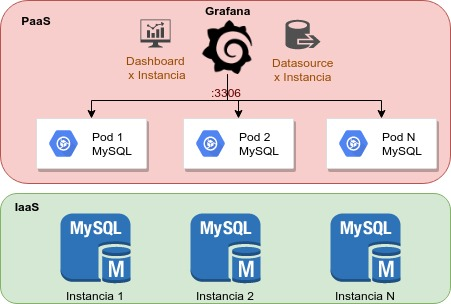

= Herramienta de monitoreo de bases de datos MySQL con Grafana para IaaS y PaaS
Author <franklin.gomez@agesic.gub.uy>
version, 2019-10-08

== Introducción
Con el presente proyecto tenemos como objetivo disponibilizar con una herramienta de monitoreo de instancias de bases de datos MySQL en IaaS y PaaS. Para lograr dicho objetivo procedimos a la construcción de un Pipeline definido en un template que una vez ejecutado hace el despliegue de una instancia modificada de grafana(dashboard y datasource preconfigurados) para monitorear la instancia de MySQL suministrada como parámetos del Template.

== Background
Partiendo de la siguiente arquitectura de solución:

Construimos un Template con los parámetros y objetos necesarios para ejecutar el Pipeline que despliegue la solución antes propuesta pero con el monitoreo de 1 sola instancia de MySQL.

=== El pipeline quedó diseñado con los siguientes Stages:

. Deploy mysql-client: Desplegamos una Pod con el binario mysql instalado
. Deploy DB-Agent: Utilizamos el Pod anterior para conectarnos a la instancia MySQL e instalar la base agente
. Test DB-Agent: Probar la conexión a la base de datos agente
. Delete mysql-client: Eliminamos el Pod creado para instalar la base de datos agente en la instancia a monitorear
. Build Custom-Grafana: Construimos una imagen de Grafana custom con un datasource y un dashboard preconfigurados hacia la instancia a monitorear
. Deploy Custom-Grafana: Despliegue de la aplicación anteriormente construida y la exposición de la ruta en OCP

== Consideraciones necesarias
* Existencia de un proyecto con una solución MySQL desplegada,necesario conocer el nombre del servicio.
* En caso que la instancia a monitorear no se encuentre en nuestro proyecto debemos conceder los permisos necesarios entre los proyectos de Openshift
* En caso de que la instancia MySQL esté desplegada en IaaS asumimos que existe las configuraciones necesarias de firewall para poder acceder a la VM por el puerto configurado(3306 por defecto) desde Openshift

== Despliegue

Iniciamos sesion en Openshift:
[source,language,attributes]
----
oc login
----

Seguidamente nos movemos para el proyecto donde vamos a desplegar la solución:
[source,language,attributes]
----
oc project monitoreo-mysql
----

Realizar el despliegue de una solución de jenkins, para ello podemos utilizar el jenkins-ephemeral que está disponible en el catálogo de Openshift(necesario crear las credenciales a mano) o utilizar una custom-jenkins disponible a través del siguiente template disponible en el Git de la plataforma.

[source,language,attributes]
----
oc create -f http://gitlab.paas.agesic.red.uy/franklin.gomez/jenkins-custom-template/raw/master/jenkins-custom-template.yaml
oc process jenkins-custom-template | oc create -f -
----

Una vez completado el despliegue del jenkins debemos realizar el despliegue del pipeline grafana-mysql-agent

== Conclusiones

== Recomendaciones
